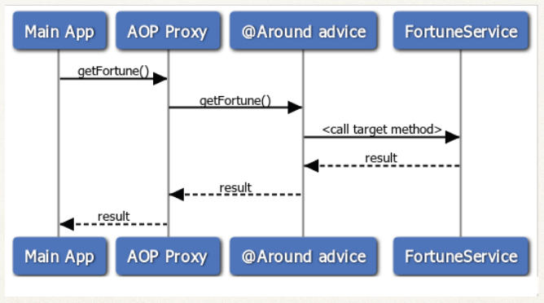
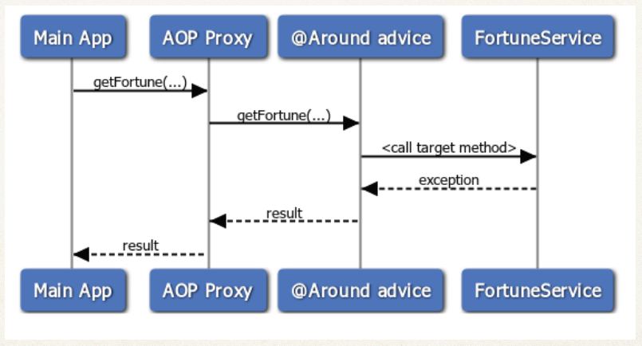
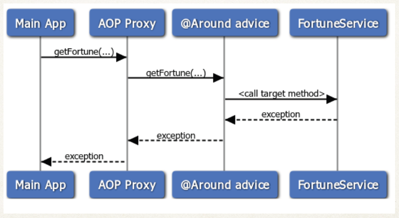
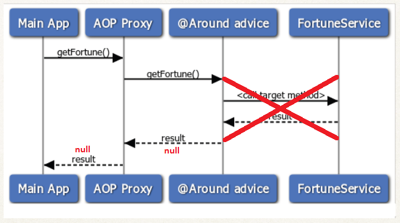

# `@Around` Advice

>This advice runs custom code
>1. **before** the target object method is called
>2. **after** the target object method call is completed


* `@Around` annotation
* use `org.aspectj.lang.annotation.Around`

e.g. `@Around("execution(* com.luv2code.aopdemo.service.*.method1())")`

#### `@Around` Advice - Use Case
* Most common: logging, auditing, security
* Pre-processing and post-processing data
* Instrumentation / profiling code
    * How long does it take for a section of code to run?
* Managing exception
    * you can swallow / handle / stop the exceptions
    * Or you can simply re-throw the exception
    * This gives you more fine-grained control over how the target method is called

#### `ProceedingJoinPoint`
when using @Around advice,

* you will get a reference to a `ProceedingJoinPoint`
* This is a handle to the **target method**
* Your code can use the `ProceedingJoinPoint` to execute **target method**
* If this is not used, **target method** will not be invoked

###### Example 1 : Happy path of `@Around`



```
@Around("execution(* com.luv2code.aopdemo.service.*.getFortune(..))")
public Object aroundGetFortune(ProceedingJoinPoint proceedingJoinPoint) throws Throwable {
	...
	// now, let's execute the method
	// proceedingJoinPoint -> handle to target method
	// .proceed() -> Execute the target method
	
	Object result = proceedingJoinPoint.proceed();
	...
	return result;
}
```

###### Example 2 : Swallow the exception using `@Around`



```
@Around("execution(* com.luv2code.aopdemo.service.*.getFortune(..))")
public Object aroundGetFortune(ProceedingJoinPoint proceedingJoinPoint) throws Throwable {
	...
	Object result = null;
	try {
		result = proceedingJoinPoint.proceed();
	} catch (Throwable e) {
		// log the exception
		myLogger.warning(e.getMessage());

		// give user a custom message
		result = "swallowed the exception!!!";
	}
	...
	return result;
}
```

###### Example 3 : Re-throw the exception using `@Around`



```
@Around("execution(* com.luv2code.aopdemo.service.*.getFortune(..))")
public Object aroundGetFortune(ProceedingJoinPoint proceedingJoinPoint) throws Throwable {
	...
	Object result = null;
	try {
		result = proceedingJoinPoint.proceed();
	} catch (Throwable e) {
		// re-throw exception
		throw e;
	}
	...
	return result;
}
```

###### Example 4 : What happens when NO ~~`ProceedingJoinPoint`~~ is used in `@Around`

Target Object method is not invoked and the result returned is `null`



```
@Around("execution(* com.luv2code.aopdemo.service.*.getFortune(..))")
public Object aroundGetFortune() throws Throwable {
	...
	Object result = null;
	...
	return result;
}
```

#### `JoinPoint` vs `ProceedingJoinPoint`

###### When to use `JoinPoint` vs `ProceedingJoinPoint`?
* Use `JoinPoint` with following advice types
    * `@Before`, `@After`, `@AfterReturning`, `@AfterThrowing`
* Use `ProceedingJoinPoint` with following advice type
    * `@Around`
